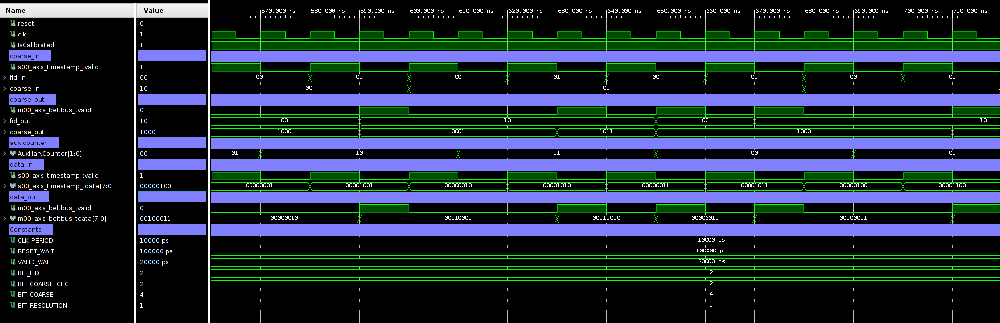
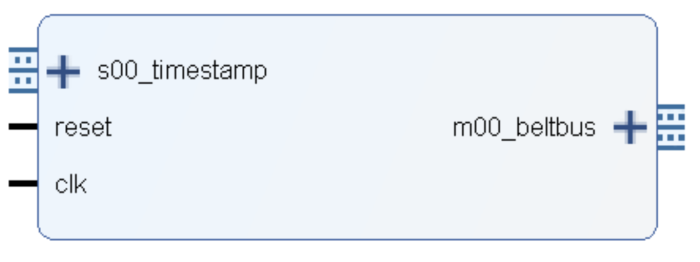
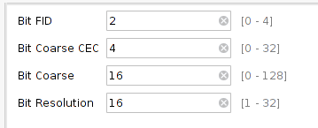
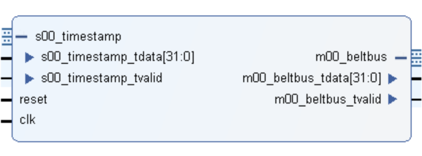

# AXI4Stream_OverflowCounter
This is a Vivado Project, used to counting the number of Overflow which occur in the timestamps coming from the TDC.
The input of the OverflowCounter is a AXI4-Stream interface consisting of a Valid and a Data channel, *s00_timestamp_tvalid* and *s00_timestamp_tdata*.
The output depends on the value of the most significant bits(*FID*) of the input.
The timestamps in output of the OverflowCounter is an AXI4 Stream interface.

If *BIT_FID = 0* the Belt Bus is removed and the output is a standard Axi4 Stream. In this case the module is transparent and the input is transferred unchanged to the output (*beltbus_tvalid <= timestamp_tvalid*, *beltbus_tdata <= timestamp_tdata*). Moreover the Counter of Overflow(*CoarseOverflow_cnt*) is not enabled.
If *BIT_FID /= 0* and *timestamp_tvalid = '1'*, the output has the following structure: if you have a measure (*fid_in = '1'*), the Fine part remains unchanged, the BIT_COARSE_IN bits of the Coarse part remains equal to the input ones, while the BIT_COARSE_OUT - BIT_COARSE_IN bits of the Coarse part are equal to an AuxiliaryCounter, which counts the number of input data which are overflows (*fid_in = 0*).
When AuxiliaryCounter arrives at all '1's and another data with *fid_in = 0* arrives, it restarts from zero and i have as output data the *CoarseOverflow_cnt*, which is increased by one; so, the output contains the *fid_overflow* (00) & *CoarseOverflow_cnt*.
If *BIT_COARSE_CEC = BIT_COARSE*, the ip-core behaves as the older version, where we have in ouput *CoarseOverflow_cnt* which increases by one every time you have in input *fid_in = '0'*, or the measure if you have in input *fid_in = '1'*.

# IP-Core
OverflowCounter for AXI4-Stream interface IP-Core.

## Generic

 - **BIT_FID**: Bit Dimension of the Fid part of the Timestamp, *NATURAL* type. If *BIT_FID = 0* the belt bus is removed and it is a standard axi4 stream.
 - **BIT_COARSE_CEC**: Bit Dimension of the Coarse part of the input Timestamp, *NATURAL* type *RANGE 0 TO 32*.
 - **BIT_COARSE**: Bit Dimension of the Coarse part of the output Timestamp, *NATURAL* type *RANGE 0 TO 128*.
 - **BIT_RESOLUTION**: Bit Dimension of the Fine part of the Timestamp, *POSITIVE* type *RANGE 1 TO 32*.

 

## Port

 - **reset**: Asynchronous system reset active high (if '1' goto reset state).

 - **clk**: System clock.

 - **s00_timestamp**: AXI4 Stream Slave (Input) interface, uncalibrated data coming from the previous module().
     - **s00_timestamp_tvalid**: Valid of the input data, *STD_LOGIC* type.
     - **s00_timestamp_tdata**: Input data (timestamp) padded to upper byte dimension, *STD_LOGIC_VECTOR((((BIT_FID + BIT_COARSE_CEC + BIT_RESOLUTION-1)/8+1)* * *8)-1 DOWNTO 0)* type, used only *STD_LOGIC_VECTOR(BIT_FID + BIT_COARSE_CEC + BIT_RESOLUTION-1 downto 0)* type.

 - **m00_beltbus**: AXI4 Stream master (Output) interface, containing the value of the input data (*s00_timestamp_tdata*) or the number of Overflow depending on the value of the FID.
     - **m00_beltbus_tvalid**: Valid of the output data, *STD_LOGIC* type.
     - **m00_beltbus_tdata**: Output data with the proper FID padded to upper byte dimension *STD_LOGIC_VECTOR((((BIT_FID + BIT_COARSE + BIT_RESOLUTION-1)/8+1)* * *8)-1 DOWNTO 0)* type, used only *STD_LOGIC_VECTOR(BIT_FID + BIT_COARSE + BIT_RESOLUTION-1 downto 0)* type.

# Sources
We can find in *hdl/* the following module directory:

 - **AXI4Stream_OverflowCounter**: Wrapper used for rename the input and output interfaces with AXI4-Stream for IP-Core, input as slave and output as a master.
 - **AXI4Stream_OverflowCounterWrapper**: Wrapper used for rename the input and output interfaces with pseudo AXI4-Stream for HDL, input as slave and output as a master.
 - **OverflowCounter**: Count the number of Overflow in the input data(*s00_timestamp_tdata*).

# Simulation
We can find in  *src/* the following module directory:

 - **tb_AXI4Stream_OverflowCounter**: HDL simulation of *AXI4Stream_OverflowCounter*.
 - **tb_AXI4Stream_OverflowCounter_behav**: Waveform of *tb_AXI4Stream_OverflowCounter*.

